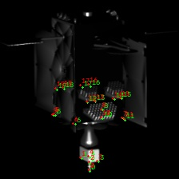
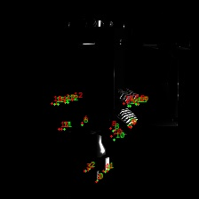

PolarFire and Xilinx accelerator trade-off
==========================================

.. table::
   :width: 100%
   :widths: auto

   +------------------------------------------------------------------+
   | Date created: 05/10/2026                                         |
   +------------------------------------------------------------------+
   | **Status:** DRAFT                                                |
   |                                                                  |
   | Latency on both accelerators is included. Sample accuracy        |
   | scores are not in this issue. The figures are qualitative.       |
   +------------------------------------------------------------------+
   | **Distribution:**                                                |
   |                                                                  |
   | - LMO (internal),                                                |
   | - European Space Agency (ESA)                                    |
   +------------------------------------------------------------------+
   | **Change Log:**                                                  |
   |                                                                  |
   | -  0.1: First draft. Xilinx accuracy baseline from the CCN1      |
   |    Design Justification File.                                    |
   | -  0.2: Deployment split, VectorBlox compile path, QAT weight    |
   |    selection, Xilinx and PolarFire latency, qualitative          |
   |    overlays.                                                     |
   +------------------------------------------------------------------+

.. table::
   :width: 100%
   :widths: auto

   +-----------------+---------------------------+--------------------------+---------------+----------+
   |                 | **Position**              | **Name**                 | **Signature** | **Date** |
   +-----------------+---------------------------+--------------------------+---------------+----------+
   | **Prepared by** | Computer Vision Engineer  | Maciej Zurad             |               |          |
   +-----------------+---------------------------+--------------------------+---------------+----------+
   | **Reviewed by** |                           |                          |               |          |
   +-----------------+---------------------------+--------------------------+---------------+----------+
   | **Approved by** |                           |                          |               |          |
   +-----------------+---------------------------+--------------------------+---------------+----------+

This document is of Luxembourg origin and is Copyright © of LMO Sarl.

Introduction
============

The DIOSSA RPO payload estimates the 6-degree-of-freedom pose of a target
spacecraft from monocular images. The vision chain is two convolutional
networks in series: FCOS for object detection, then MobilePose for
keypoint regression. In CCN1 those networks were trained in floating
point, refined with quantization-aware training, and compiled onto the
Xilinx Deep Learning Processing Unit (DPU) in an UltraScale+ MPSoC
through Vitis-AI 3.5.

This note compares that baseline with the same networks compiled for the
Microchip PolarFire SoC and its VectorBlox accelerator (SDK 3.1). The
networks and the CCN1 weights stay the same. What changes is the
accelerator and the compile path.

Objective
---------

Show that the CCN1 networks can be compiled and executed on PolarFire,
and put the measured latency next to the Xilinx DPU and CPU-head
measurements from the earlier benchmarking campaign.

Scored accuracy on the PolarFire sample (IoU, keypoint error) is not
part of this issue. The CCN1 validation numbers remain the accuracy
record. A few overlays are included so the running chain can be seen.

Scope
-----

- Object detection: FCOS, input 384 × 288, checkpoint ``quare-delf``
  epoch 19.
- Keypoint regression: MobilePose, input 224 × 224, 20 keypoints,
  checkpoint ``bijou-rasp`` epoch 17.

A second FCOS resolution, 640 × 480, was trained in CCN1. It is quoted
only as context. It was not compiled for PolarFire.

Applicable Documents
--------------------

.. table::
   :width: 100%
   :widths: auto

   +----------+---------------------------------------------------------+------------+
   | **AD-n** | **Document Title**                                      | **Issue**  |
   +----------+---------------------------------------------------------+------------+
   | AD-1     | PL23-0005-DJF-0001 i1.1 (DIOSSA-CCN1)                   | 1.1        |
   +----------+---------------------------------------------------------+------------+

Reference Documents
-------------------

.. table::
   :width: 100%
   :widths: auto

   +----------+--------------------------------------------------------------+
   | **RD-n** | **Document Title**                                           |
   +----------+--------------------------------------------------------------+
   | RD-1     | VectorBlox SDK, Tutorial Walkthrough Guide                   |
   |          | (``third-party/vbx-sdk/docs/tutorial_walkthrough_guide.md``) |
   +----------+--------------------------------------------------------------+
   | RD-2     | Microchip VectorBlox Accelerator SDK, product description    |
   |          | of the 3.1 release                                           |
   +----------+--------------------------------------------------------------+

Definitions
-----------

.. list-table::
   :widths: 20 80
   :header-rows: 1

   * - Acronym
     - Meaning
   * - DPU
     - Xilinx Deep Learning Processing Unit
   * - EDGE
     - The part of the network compiled onto the accelerator
   * - FLOAT
     - The float32 network, evaluated on a GPU
   * - FCOS
     - Fully Convolutional One-Stage object detector
   * - QAT
     - Quantization-aware training. Weights are stored as float32, but they were trained under a fake-quantization constraint.
   * - VNNX
     - VectorBlox binary executed by the accelerator

How the network is split
========================

Following the previous DIOSSA phases, each network is split in two.

The first part runs on the FPGA accelerator. It is kept as large as the
core will accept, so the convolutional trunk uses the accelerator and
the CPU is left with as little as possible.

The second part stays on the CPU. It is the tail that cannot be placed
on the accelerator. For VectorBlox that tail is whatever does not
survive the path to a full-integer INT8 TensorFlow Lite graph and then
to ``vnnx_compile``. The reasons a layer is left behind are:

- the operator is outside the INT8 TensorFlow Lite set that VectorBlox
  compiles [RD-1];
- the layer is post-processing rather than a convolution. The SDK
  tutorials cut this off on purpose (``tflite_cut`` on YOLOv8) before
  compilation: box decoding, non-maximum suppression, top-k, and the
  reduction from a heatmap to a coordinate;
- the tensor shape is dynamic, or an attribute of the operator (rank,
  dilation, alignment) is not accepted by the compiler;
- the activation memory of the whole graph does not fit the selected
  core. The build used here is the V1000 configuration with no
  compression.

On PolarFire the CPU tail is an ONNX graph executed by ONNX Runtime on
the RISC-V application cores. Accelerator outputs are dequantized on
the CPU and then passed into that graph. FCOS consumes the box, class,
and centerness maps and emits boxes, scores, and labels. MobilePose
consumes the heatmaps and emits coordinates. The same split was used
on the Xilinx side: the DPU runs an ``.xmodel``, and the post-processing
head runs as ONNX on the MPSoC CPU.

Embedding a PyTorch model on PolarFire
======================================

VectorBlox does not execute PyTorch. The published SDK 3.1 path for an
ONNX model is: convert to TensorFlow Lite, quantize to INT8 if the file
is not already quantized, insert preprocessing with
``tflite_preprocess``, and compile with ``vnnx_compile`` [RD-1], [RD-2].
The DIOSSA builds follow that path. The steps actually run are:

1. Load the PyTorch checkpoint and export two ONNX files. One is the
   accelerator trunk. The other is the CPU head.
2. Build a calibration sample. One hundred images are taken from the
   CCN1 test sample, resized to the network input, and stored as a
   NumPy array. The array is normalized with the ImageNet mean
   (0.485, 0.456, 0.406) and standard deviation (0.229, 0.224, 0.225).
3. Simplify the ONNX graph with ``onnxsim``, so the converter sees a
   static graph without the training-time debris.
4. Convert ONNX to full-integer INT8 TensorFlow Lite with ``onnx2tf``.
   This step both translates the graph and quantizes it. The
   calibration array is what the quantizer uses to pick a scale and a
   zero-point per tensor.
5. Insert preprocessing with ``tflite_preprocess``. Mean and scale are
   written into the graph, scaled into the 0–255 pixel range, so the
   accelerator consumes the image with the same normalization the
   network was trained with. The tool also inserts the uint8-to-int8
   quantize at the input.
6. Compile with ``vnnx_compile -s V1000 -c ncomp``. The output is a
   ``.vnnx`` binary for the V1000 core, without weight compression.

``vnnx_compile`` is the step that maps the INT8 graph onto the
VectorBlox core. Anything it rejects stays in the ONNX head from step 1.

Why the QAT checkpoints were used
=================================

The first attempt was to embed the CCN1 float checkpoints
(``licit-weal`` for FCOS, ``blest-harl`` for MobilePose). That
quantization did not complete. ``onnx2tf`` could not assign a scale and
a zero-point on those weights, so no INT8 TensorFlow Lite file was
produced and there was nothing to compile.

The weights that did quantize are the CCN1 quantization-aware
checkpoints, ``quare-delf`` and ``bijou-rasp``. They are still stored
as float32. They were trained with Vitis-AI fake quantization, so the
values already sit on a grid that post-training quantization can
represent. With those weights the same calibration sample produces a
finite scale and zero-point, and the compile goes through.

This is the same pair that was embedded on the Xilinx DPU in CCN1.
The float parents are the accuracy reference. They are not the binaries
on either accelerator.

Xilinx accuracy baseline
========================

The figures in this section are copied from AD-1. They were measured on
the CCN1 validation set. They are not re-measured in this issue, and
they are not PolarFire numbers. Inference rates quoted from AD-1 were
measured on a laptop RTX 3070, not on the DPU.

Object detection (FCOS)
-----------------------

FCOS was selected over Faster R-CNN in CCN1. On a 480 × 640 input the
float FCOS reached IoU 0.874 and mAP at IoU 0.75 of 0.956, against
0.853 and 0.901 for Faster R-CNN, at 45.78 FPS against 37.66 FPS on the
RTX 3070, with 32.1 M parameters against 43 M. Faster R-CNN cannot be
trained with the Vitis-AI quantization-aware procedure, so it was
dropped.

The embedded resolution is 384 × 288. The best float model at that size
is ``licit-weal`` (IoU 0.925). Quantization-aware training from that
checkpoint produced ``quare-delf`` (IoU 0.858). The loss accepted in
CCN1 is 0.067 IoU. The 640 × 480 QAT run lost more (IoU 0.958 down to
0.819) and was not the network embedded for the shorter approach.

.. list-table:: FCOS, 384 × 288. Validation metrics from AD-1.
   :header-rows: 1
   :widths: 40 30 30

   * -
     - FLOAT ``licit-weal``
     - QAT ``quare-delf``
   * - Started from
     - COCO
     - licit-weal
   * - Input [W × H]
     - 384 × 288
     - 384 × 288
   * - IoU
     - 0.925
     - 0.858
   * - mAP
     - 0.858
     - 0.693
   * - mAP at IoU > 0.50
     - 0.989
     - 0.978
   * - mAP at IoU > 0.75
     - 0.946
     - 0.850
   * - RTX 3070 throughput
     - 65.12 FPS
     - not reported

Keypoint regression (MobilePose)
--------------------------------

The float model selected in CCN1 is ``blest-harl``, initialised from the
DIOSSA-1 MobilePose checkpoint and trained on 20 keypoints. Raising the
input from 224 × 224 to 448 × 448 did not improve accuracy. Predicting
all 41 keypoints was worse than the 20-keypoint subset. ``blest-harl``
is reported at 3.799 L2 pixel error. AD-1 does not repeat whether that
L2 is on the 2590 × 1942 camera image or on the network input. The QAT
section does give the float L1 on the camera image: 4.783 px.

The QAT model is ``bijou-rasp``, started from ``blest-harl``. L1 on the
camera image is 5.303 px. The accepted quantization loss is 0.520 px.
Two other learning rates were worse (``smoky-quey`` 6.848 px,
``swish-mows`` 5.797 px).

.. list-table:: MobilePose, 20 keypoints. Metrics from AD-1.
   :header-rows: 1
   :widths: 46 27 27

   * -
     - FLOAT ``blest-harl``
     - QAT ``bijou-rasp``
   * - Started from
     - DIOSSA-1 MobilePose
     - blest-harl
   * - Input
     - 224 × 224
     - 224 × 224
   * - Keypoints
     - 20
     - 20
   * - L2 pixel error (reference frame not stated)
     - 3.799
     - —
   * - L1 on the camera image [2590 × 1942], px
     - 4.783
     - 5.303
   * - L1 on the network input, px
     - not stated
     - 1.564
   * - L2 on the camera image [2590 × 1942], px
     - not stated
     - 4.216
   * - L2 on the network input, px
     - not stated
     - 1.238

On the DPU, AD-1 reports the end-to-end pose rather than a separate IoU
or keypoint error for the compiled binary. Relative position error of
the QAT pair on the DPU stays under 2% at 1-sigma on trajectories 2
and 3. A rotation error near 180 degrees on trajectory 1 is attributed
to symmetry of the keypoints and is already present on the float models.

Latency
=======

Both platforms run the same split: the convolutional trunk on the
accelerator, the head on the CPU through ONNX Runtime. The times below
are those two pieces, measured separately and then added. They are not
one timed capture of the whole payload loop. Image decode and the pose
solver are not included.

Xilinx
------

The Xilinx numbers come from the earlier campaign on the MPSoC
(``reports/xilinx-latency-benchmarks``). The DPU time is
``xdputil benchmark`` with one thread, run for 60 seconds. The CPU time
is ``onnxruntime_perf_test`` in duration mode for 20 seconds, on the
ONNX head. The thread count of that ONNX run was not pinned.

The rows used here are the embedded shapes. MobilePose is
``mobilepose_224x224_20k`` (224 × 224, 20 keypoints). FCOS is
``fcos_288x384_2c`` (height 288, width 384, two classes). Other shapes
in those files are not the binaries under comparison.

.. list-table:: Xilinx MPSoC. DPU time and ONNX Runtime head, measured separately.
   :header-rows: 1
   :widths: 28 24 24 24

   * - 
     - DPU
     - CPU head
     - Sum
   * - MobilePose 224 × 224
     - 2.95 ms (338.5 FPS)
     - 56.84 ms
     - 59.8 ms (16.7 FPS)
   * - FCOS 384 × 288
     - 51.81 ms (19.30 FPS)
     - 4.48 ms
     - 56.3 ms (17.8 FPS)

On the DPU, MobilePose is a small fraction of the chain. Almost all of
the summed time is the ONNX head. FCOS is the opposite: the DPU is the
slow piece, and the head is under 5 ms.

PolarFire
---------

PolarFire times were measured on the board at 192.168.20.6, VectorBlox
V1000, no compression. Each network was run on 50 images from the CCN1
sample, one loop per image. The standard deviation of the accelerator
time is 0.01 ms for MobilePose and 0.02 ms for FCOS, so the mean is the
whole story. CPU post-processing is dequantization plus ONNX Runtime.
ONNX Runtime was run with one intra-op thread.

.. list-table:: PolarFire VectorBlox. Mean over 50 images.
   :header-rows: 1
   :widths: 34 33 33

   * - Metric
     - MobilePose 224 × 224
     - FCOS 384 × 288
   * - Accelerator
     - 17.20 ms (58.2 FPS)
     - 394.67 ms (2.53 FPS)
   * - Dequantize
     - 4.33 ms
     - 1.81 ms
   * - ONNX Runtime
     - 16.80 ms
     - 13.37 ms
   * - CPU post-processing
     - 21.13 ms
     - 15.18 ms
   * - End to end
     - 38.33 ms (26.1 FPS)
     - 409.85 ms (2.44 FPS)

Comparison
----------

.. list-table:: Accelerator time and end-to-end time.
   :header-rows: 1
   :widths: 22 26 26 26

   * -
     - Xilinx DPU
     - PolarFire VectorBlox
     - Ratio, PolarFire / Xilinx
   * - MobilePose accelerator
     - 2.95 ms
     - 17.20 ms
     - 5.8
   * - MobilePose end to end
     - 59.8 ms (sum)
     - 38.33 ms
     - 0.64
   * - FCOS accelerator
     - 51.81 ms
     - 394.67 ms
     - 7.6
   * - FCOS end to end
     - 56.3 ms (sum)
     - 409.85 ms
     - 7.3

MobilePose on the VectorBlox core is slower than on the DPU (17.2 ms
against 2.95 ms). The ONNX head on the PolarFire RISC-V cores is faster
than the head measured on the MPSoC (21.1 ms against 56.8 ms). Added
together, the PolarFire chain is the shorter one: 38.3 ms against
59.8 ms.

FCOS does not follow that pattern. The VectorBlox core takes 395 ms,
about 7.6 times the DPU, and the head does not compensate. End to end
is 410 ms, 2.4 frames per second, against 56 ms on the Xilinx sum.
Closing that gap is the open performance item. The two measurements
were not made with the same harness, so the ratio is the right
precision to claim, not a tenth of a millisecond.

Qualitative overlays
====================

The figures below are PolarFire outputs on the CCN1 Inmarsat-5 sample,
drawn on the network input (224 × 224 for MobilePose, 384 × 288 for
FCOS). Ground truth is green. The prediction is red. These frames are
examples. They are not a score.

Keypoint regression
-------------------

On these three frames the red keypoints sit on the same structure as
the green ones: body, antennae, and nozzle. That is the behaviour the
CCN1 QAT model had on the DPU. It is not a measured L1.

   MobilePose, ``VisCam_0021021``. Green: ground truth. Red: PolarFire.

.. figure:: figures/VisCam_0001775.jpg
   :width: 55%
   :align: center

   MobilePose, ``VisCam_0001775``. Green: ground truth. Red: PolarFire.

   MobilePose, ``VisCam_0016747``. Green: ground truth. Red: PolarFire.

Object detection
----------------

On these frames the network returns a detection, and the red box falls
inside the spacecraft. The box is much smaller than the green
ground-truth extent. That is visible here and it is not scored in this
issue. It has to be explained before detection can be called equivalent
to the CCN1 QAT result (IoU 0.858 on the validation set).

.. figure:: figures/VisCam_0002932.jpg
   :width: 70%
   :align: center

   FCOS, ``VisCam_0002932``. Green: ground truth. Red: PolarFire.

.. figure:: figures/VisCam_0008192.jpg
   :width: 70%
   :align: center

   FCOS, ``VisCam_0008192``. Green: ground truth. Red: PolarFire.

.. figure:: figures/VisCam_0031435.jpg
   :width: 70%
   :align: center

   FCOS, ``VisCam_0031435``. Green: ground truth. Red: PolarFire.

Conclusion
==========

The CCN1 QAT checkpoints compile for VectorBlox and run on the
PolarFire SoC, with the convolutional trunk on the accelerator and the
head on ONNX Runtime. The float checkpoints do not quantize. The QAT
weights do, which is why the switch uses ``quare-delf`` and
``bijou-rasp`` rather than ``licit-weal`` and ``blest-harl``.

On latency, MobilePose end to end is shorter on PolarFire than the
summed Xilinx measurement (38 ms against 60 ms). FCOS is not: the
VectorBlox core is about eight times the DPU time, and the chain runs
at 2.4 frames per second.

On the overlays, MobilePose keypoints follow the ground truth on the
frames shown. FCOS places a box on the spacecraft, and that box does
not cover the ground-truth extent. Neither observation replaces a
scored comparison against the Xilinx edge binaries on this sample.

Open items
==========

#. Score FCOS and MobilePose on the shared CCN1 sample, PolarFire
   against the Xilinx edge binaries, and report IoU and keypoint error.
#. Account for the FCOS accelerator time (395 ms on VectorBlox against
   52 ms on the DPU): operator coverage, the V1000 configuration, and
   how much of the trunk actually landed on the core.
#. Account for the detection boxes in the figures, which sit inside
   the ground-truth box and do not match its extent.
