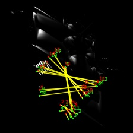
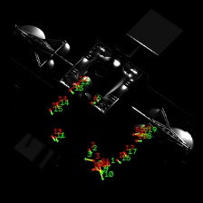
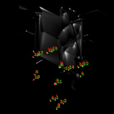
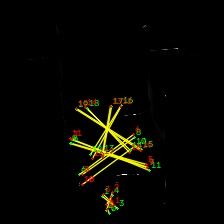
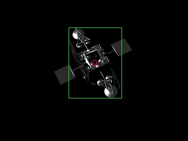
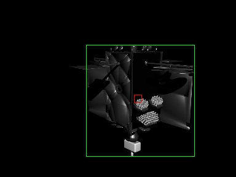
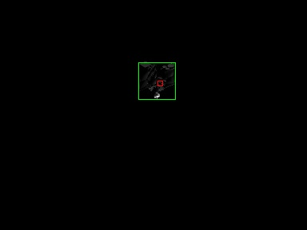

PolarFire and Xilinx accelerator trade-off
==========================================

.. table::
   :width: 100%
   :widths: auto

   +------------------------------------------------------------------+
   | Date created: 05/10/2026                                         |
   +------------------------------------------------------------------+
   | **Distribution:**                                                |
   |                                                                  |
   | - LMO (internal),                                                |
   | - European Space Agency (ESA)                                    |
   +------------------------------------------------------------------+
   | **Change Log:**                                                  |
   |                                                                  |
   | -  1.0: First release                                            |
   +------------------------------------------------------------------+

.. table::
   :width: 100%
   :widths: auto

   +-----------------+---------------------------+--------------------------+---------------+----------+
   |                 | **Position**              | **Name**                 | **Signature** | **Date** |
   +-----------------+---------------------------+--------------------------+---------------+----------+
   | **Prepared by** | Computer Vision Engineer  | Maciej Zurad             |               |          |
   +-----------------+---------------------------+--------------------------+---------------+----------+
   | **Reviewed by** |                           |                          |               |          |
   +-----------------+---------------------------+--------------------------+---------------+----------+
   | **Approved by** |                           |                          |               |          |
   +-----------------+---------------------------+--------------------------+---------------+----------+

This document is of Luxembourg origin and is Copyright © of LMO Sarl.

Introduction
============

The DIOSSA RPO payload estimates the 6-degree-of-freedom pose of a target
spacecraft from monocular images. The vision chain is two convolutional
networks in series: FCOS for object detection, then MobilePose for
keypoint regression. In CCN1 those networks were trained in floating
point, refined with quantization-aware training, and compiled onto the
Xilinx Deep Learning Processing Unit (DPU) in an UltraScale+ MPSoC
through Vitis-AI 3.5.

This note compares that baseline with the same networks compiled for the
Microchip PolarFire SoC and its VectorBlox accelerator (SDK 3.1). The
architectures and the CCN1 weights are unchanged. The item under
comparison is the accelerator and the compilation path.

Objective
---------

The objective is to record whether the CCN1 networks compile and run on
PolarFire, and to set the measured latency beside the Xilinx DPU and
CPU-head measurements from the earlier benchmarking campaign.

Accuracy on the PolarFire test set (IoU, keypoint error) is not
part of this issue yet.

Scope
-----

This note focuses on two specific models and configurations from CCN1:

  - FCOS for object detection, using an input size of 384 × 288, (HxW) named  ``quare-delf``.
  - MobilePose for keypoint regression, using an input size of 224 × 224 with 20 keypoints named ``bijou-rasp``.

An additional FCOS network at 640 × 480 resolution was also trained during CCN1 and may be referenced for context, but it was not deployed or compiled for PolarFire as part of this comparison.

Applicable Documents
--------------------

.. table::
   :width: 100%
   :widths: auto

   +----------+---------------------------------------------------------+------------+
   | **AD-n** | **Document Title**                                      | **Issue**  |
   +----------+---------------------------------------------------------+------------+
   | AD-1     | PL23-0005-DJF-0001 i1.1 (DIOSSA-CCN1)                   | 1.1        |
   +----------+---------------------------------------------------------+------------+
   | AD-2     | PL24-0001-DJF-0002 i1.1                                 | 1.1        |
   |          | (Algorithm Design Justification File)                   |            |
   +----------+---------------------------------------------------------+------------+

Reference Documents
-------------------

.. table::
   :width: 100%
   :widths: auto

   +----------+--------------------------------------------------------------+
   | **RD-n** | **Document Title**                                           |
   +----------+--------------------------------------------------------------+
   | RD-1     | VectorBlox SDK, Tutorial Walkthrough Guide                   |
   |          | (``VectorBlox-SDK/docs/tutorial_walkthrough_guide.md``)      |
   +----------+--------------------------------------------------------------+
   | RD-2     | Microchip VectorBlox Accelerator SDK, product description    |
   |          | of the 3.1 release                                           |
   +----------+--------------------------------------------------------------+

Definitions
-----------

.. list-table::
   :widths: 20 80
   :header-rows: 1

   * - Acronym
     - Meaning
   * - COCO
     - Common Objects in Context dataset
   * - DPU
     - Xilinx Deep Learning Processing Unit
   * - EDGE
     - The part of the network compiled onto the accelerator
   * - FLOAT
     - The float32 network, evaluated on a GPU
   * - FCOS
     - Fully Convolutional One-Stage object detector
   * - PTQ
     - Post-training quantization. Scales and zero-points are computed from a calibration set after training.
   * - QAT
     - Quantization-aware training. The stored weights are float32, but training was performed under a fake-quantization constraint.
   * - VNNX
     - VectorBlox binary executed by the accelerator

How the network is split
========================

Following the previous DIOSSA phases, each network is divided into two
parts.

The accelerator part, referred to below as the edge, runs on the FPGA.
It is made as large as the core will accept, so that the convolutional
trunk uses the accelerator and the CPU is left with as little work as
possible.

The second part stays on the CPU. It is the tail that cannot be placed
on the accelerator. For VectorBlox, the “tail” refers to any part of 
the network that cannot make it through the conversion 
to a fully integer INT8 TensorFlow Lite graph 
and subsequent compilation with ``vnnx_compile``. 
The reasons a layer may be left out include:

- the operator is outside the INT8 TensorFlow Lite set that VectorBlox
  compiles [RD-1];
- the layer is post-processing rather than a convolution. For example:
  box decoding, non-maximum suppression, top-k selection, and the
  reduction from a heatmap to a coordinate;
- the tensor shape is dynamic, or an attribute of the operator (rank,
  dilation, alignment) is not accepted by the compiler;
- the activation memory of the whole graph does not fit the selected
  core. The build used here is the V1000 configuration with no
  compression.

On PolarFire the CPU tail is an ONNX graph executed by ONNX Runtime on
the RISC-V application cores. Accelerator outputs are dequantized on
the CPU and then passed into that graph. FCOS consumes the box, class,
and centerness feature maps and emits boxes, scores, and labels. MobilePose
consumes the unnormalized heatmaps and emits coordinates and normalized heatmaps.
The same split was used on the Xilinx side: 
the DPU runs an ``.xmodel``, and the post-processing head runs as ONNX on the MPSoC CPU.

Embedding a PyTorch model on PolarFire
=======================================

VectorBlox does not natively support PyTorch models. 
To deploy a PyTorch model to PolarFire's FPGA accelerator it must be converted 
into VNNX format using the VectorBlox SDK.

We use the following steps:

1. Load the PyTorch checkpoint and export two ONNX files. One is the
   accelerator "edge" part. The other is the CPU "tail" part.
2. Build a calibration sample. One hundred images are taken from the
   CCN1 test sample, resized to the network input, and stored as a
   NumPy array. The array is normalized to 0 to 1.0 range.
3. Simplify the ONNX graph with ``onnxsim``, so the converter receives a
   static graph without extra nodes or artifacts left from training.
4. Convert ONNX to full-integer INT8 TensorFlow Lite with ``onnx2tf``.
   This step both translates the graph and quantizes it. The
   calibration array is what the quantizer uses to pick a scale and a
   zero-point per tensor. Mean and standard deviation are used to normalize the calibration array here.
5. Insert preprocessing with ``tflite_preprocess``. Mean and standard deviation are
   written into the graph, scaled into the 0–255 pixel range, so the
   accelerator consumes the image with the same normalization the
   network was trained with. The tool also inserts the uint8-to-int8
   quantize at the input.
6. Compile with ``vnnx_compile -s V1000 -c ncomp``. The output is a
   ``.vnnx`` binary for the V1000 core, without weight compression.

If anything fails, it's most likely because the layer is not supported by the compiler
and the model must be split in a different place.

Why the QAT checkpoints were used
=================================

The first attempt was to embed the CCN1 float checkpoints
(``licit-weal`` for FCOS, ``blest-harl`` for MobilePose). That
quantization did not complete. ``onnx2tf`` could not assign a scale and
a zero-point on those weights, so no INT8 TensorFlow Lite file was
produced and there was nothing to compile.

The weights that did quantize are the CCN1 quantization-aware
checkpoints, ``quare-delf`` and ``bijou-rasp``. They are still stored
as float32. They were trained with Vitis-AI fake quantization, so the
values already sit on a grid that post-training quantization (PTQ) can
represent. With those weights the same calibration sample produces a
finite scale and zero-point, and we can proceed with the compilation.

This is the same pair that was embedded on the Xilinx DPU in CCN1.
The float parents are the accuracy reference. They are not the binaries
on either accelerator.

Xilinx accuracy baseline
========================

The figures in this section are copied from AD-1. They were measured on
the CCN1 test set. They are not re-measured in this issue, and
they are not PolarFire numbers. Inference rates quoted from AD-1 were
measured on a laptop RTX 3070, not on the DPU.

Object detection (FCOS)
-----------------------

During CCN1, FCOS was selected over Faster R-CNN. On a 480 × 640 input the
float FCOS reached IoU 0.874 and mAP@IoU>0.75 of 0.956, against
0.853 and 0.901 for Faster R-CNN, at 45.78 FPS against 37.66 FPS on the
RTX 3070, with 32.1 M parameters against 43 M. Additionally, it wasn't possible to train Faster R-CNN with Vitis-AI QAT, so it was dropped from further consideration.

We then lowered the resolution to 384 × 288, because we encountered memory issues when attempting QAT on the full 640 x 480 resolution. The best float model at that size was ``licit-weal``\(IoU 0.925).
Quantization-aware training from that checkpoint produced ``quare-delf``\ (IoU 0.858). The performance degradation due to quantization was therefore at -0.067 IoU.

.. list-table:: FCOS, 384 × 288. FLOAT vs QAT performance metrics from [AD-1].
   :header-rows: 1
   :widths: 40 27 27 27

   * -
     - ``licit-weal`` (FLOAT)
     - ``quare-delf`` (QAT)
     - difference
   * - Started from
     - COCO
     - licit-weal
     - —
   * - Input [W × H]
     - 384 × 288
     - 384 × 288
     - —
   * - IoU
     - 0.925
     - 0.858
     - -0.067
   * - mAP
     - 0.858
     - 0.693
     - -0.165
   * - mAP at IoU > 0.50
     - 0.989
     - 0.978
     - -0.011
   * - mAP at IoU > 0.75
     - 0.946
     - 0.850
     - -0.096

Keypoint regression (MobilePose)
--------------------------------

The float model selected in CCN1 was ``blest-harl``, initialised from the
DIOSSA-1 MobilePose checkpoint and trained on 20 keypoints. Raising the
input from 224 × 224 to 448 × 448 did not improve accuracy, although a further study
is planned [AD-2] to determine if the network would benefit from a larger input image size at closer distances specifically. 

The QAT model was ``bijou-rasp``, started from ``blest-harl``. L2 pixel error on the
camera image was 5.303 px on the original image input shape.
The accepted loss of accuracy due to quantization was -1.504 px.

.. list-table:: MobilePose, 224x224 input, 20 keypoints. FLOAT vs QAT performance metrics from [AD-1].
   :header-rows: 1
   :widths: 46 27 27 27

   * -
     - ``blest-harl`` (FLOAT)
     - ``bijou-rasp`` (QAT)
     - difference
   * - Started from
     - DIOSSA-1 MobilePose
     - blest-harl
     - —
   * - Input
     - 224 × 224
     - 224 × 224
     - —
   * - Keypoints
     - 20
     - 20
     - —
   * - L2 on the camera image [2590 × 1942], px
     - 3.799
     - 5.303
     - -1.504
   * - L2 on the network input [224 × 224], px
     - 1.114
     - 1.238
     - -0.124

Latency
=======

Both platforms run the same split: the convolutional EDGE part on the
accelerator, the TAIL part on the CPU through ONNX Runtime. The times below
are those two pieces, measured separately and then added. They are not
one timed capture of the whole payload loop. Image decode and the pose
solver are not included.

Xilinx
------

The Xilinx numbers come from the earlier benchmarking campaign on the Xilinx MPSoC
that addressed the RID DS-10.
The DPU time was measured with ``xdputil benchmark`` run for 60 seconds. 
The CPU time was measured with ``onnxruntime_perf_test`` for 20 seconds and the thread count of that ONNX run was not pinned.

.. list-table:: Xilinx MPSoC. DPU time and ONNX Runtime head, measured separately.
   :header-rows: 1
   :widths: 28 24 24 24

   * - 
     - DPU
     - CPU head
     - Sum
   * - MobilePose 224 × 224
     - 2.95 ms (338.5 FPS)
     - 56.84 ms
     - 59.8 ms (16.7 FPS)
   * - FCOS 384 × 288
     - 51.81 ms (19.30 FPS)
     - 4.48 ms
     - 56.3 ms (17.8 FPS)

On the DPU, MobilePose is a small fraction of the processing chain. Almost all of
the summed time lies in the CPU tail running on the CPU. FCOS is the opposite: the DPU is the
slow piece, and the CPU tail time is under 5 ms.

PolarFire
---------

PolarFire times were measured on the devkit board running VectorBlox SDK 3.1.
The edge parts of the models were compiled onto the VectorBlox core  with V1000 configuration and no compression.
Each network was run on 50 images from the CCN1
sample, one loop per image. The standard deviation of the accelerator
time is 0.01 ms for MobilePose and 0.02 ms for FCOS showing that the measurements are stable.

.. list-table:: PolarFire VectorBlox. Mean over 50 images.
   :header-rows: 1
   :widths: 34 33 33

   * - Metric
     - MobilePose 224 × 224
     - FCOS 384 × 288
   * - Accelerator
     - 17.20 ms (58.2 FPS)
     - 394.67 ms (2.53 FPS)
   * - Dequantize
     - 4.33 ms
     - 1.81 ms
   * - ONNX Runtime
     - 16.80 ms
     - 13.37 ms
   * - End to end
     - 38.33 ms (26.1 FPS)
     - 409.85 ms (2.44 FPS)

Comparison
----------

.. list-table:: Accelerator time and end-to-end time.
   :header-rows: 1
   :widths: 22 26 26

   * - Metric
     - Xilinx DPU
     - PolarFire VectorBlox
   * - MobilePose accelerator
     - 2.95 ms
     - 17.20 ms
   * - MobilePose end to end
     - 59.8 ms (sum)
     - 38.33 ms
   * - FCOS accelerator
     - 51.81 ms
     - 394.67 ms
   * - FCOS end to end
     - 56.3 ms (sum)
     - 409.85 ms
   * - Full pose estimation chain
     - 59.8+56.3 = 116.1 ms
     - 38.33+409.85 = 448.18 ms

MobilePose on the VectorBlox core is slower than on the DPU (17.2 ms
against 2.95 ms). The ONNX head on the PolarFire RISC-V cores is faster
than the head measured on the MPSoC (21.1 ms against 56.8 ms). Added
together, the PolarFire chain is the shorter one: 38.3 ms against
59.8 ms.

FCOS does not follow that pattern. The VectorBlox core takes 395 ms,
about 7.6 times the DPU, and the head does not compensate. End to end
is 410 ms, 2.4 frames per second, against 56 ms on the Xilinx's accelerator.

Therefore we show that we meet the latency requirements (1Hz) for the application when 
switching from Xilinx to PolarFire.

Improving the processing time of the FCOS model on PolarFire and exploring a smaller object detection model are both potential areas for future work, as the current model exhibits excessive complexity relative to the application's requirements.

Qualitative overlays
====================

The figures below are PolarFire outputs from the CCN1 test set,
drawn on the network input images (224 × 224 for MobilePose, 384 × 288 for
FCOS). Ground truth is shown in green and predictions in red. Yellow lines show GT and prediciton keypoints pairs. We can observe that for some samples predicitons line up accurately with the ground truth, but for others they do not. These errors are quite large for the outliers and therefore we cannot provide reliable accuracy metrics (L2 pixel error, etc.) for this model.

Keypoint regression
-------------------

On these three frames the red keypoints sit on the same structure as
the green ones: body, antennae, and nozzle.

   MobilePose, ``VisCam_0001775``. Green: ground truth. Red: PolarFire.

   MobilePose, ``VisCam_0012391``. Green: ground truth. Red: PolarFire.

   MobilePose, ``VisCam_0005108``. Green: ground truth. Red: PolarFire.

   MobilePose, ``VisCam_0029974``. Green: ground truth. Red: PolarFire.

Object detection
----------------

On these frames the network returns a detection, and the bounding box falls
inside the spacecraft. The box is much smaller than the green
ground-truth extent. That is visible in the samples below. This behavious can be observed 
in most of the samples consitently and therefore we cannot provide reliable accuracy metrics (IoU, mAP, etc.) for this model.

   FCOS, ``VisCam_0002932``. Green: ground truth. Red: PolarFire.

   FCOS, ``VisCam_0008192``. Green: ground truth. Red: PolarFire.

   FCOS, ``VisCam_0031435``. Green: ground truth. Red: PolarFire.

Conclusion
==========

The QAT model checkpoints from CCN1 compile for VectorBlox and run on the
PolarFire SoC, with the convolutional edge part on the accelerator and the
tail part on CPU using ONNX Runtime.

On latency, MobilePose end to end is shorter on PolarFire than the
summed Xilinx measurement (38 ms against 60 ms). FCOS is not: the
VectorBlox core is about eight times the DPU time, and the chain runs
at 2.4 frames per second. We show that we meet the latency requirements (1Hz) for the application when 
switching from Xilinx to PolarFire.

On qualitative overlays, MobilePose keypoints follow the ground truth on the
some frames shown above and not on others. FCOS places a box on the spacecraft, and that box does
not cover the ground-truth extent.

Open items
==========

#. Even though the models went through the embedding process, we did not validate the accuracy of the models on the CCN1 test set and therefore counldn't compare if there is a performance difference betwen Xilinx and PolarFire. Additional effort must be put into veryfing what is the underlying reason for the large performance degradation. One possible reason can be due to the quantization process, or because the reused weights from CCN1 are not optimal for quantizing specifically to PolarFire. We might have to look into running QAT tailor for the PolarFire platform. 

#. Consider a smaller object detection model that maintains accuracy when quantizing. FCOS is a quite large model and it is not clear if it is necessary for the application. The single spacecraft object detection task is arguably simplier than the keypoint regression and therefore a smaller model should be sufficient. We shall consider models from the YOLO family as they have been widely used for object detection on embedded devices.
